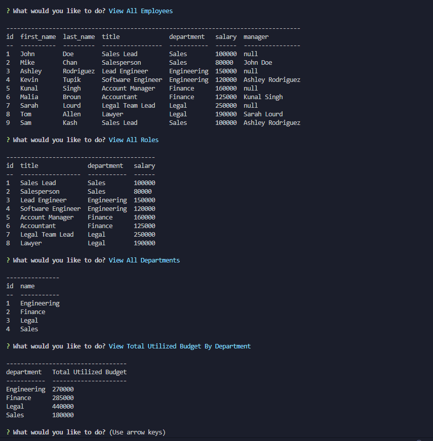

# Employee Tracker

## Description

This is a command-line application, which uses Inquirer , and MySQL for creating, saving, updating and deleting employees data from the database.

## Usage

The user will be presented with the following options: view all departments, view all roles, view all employees, view total utilized budget by department, add a department, add a role, add an employee, and update an employee role.

Go to [Video demonstrating the functionality of the application](https://drive.google.com/file/d/1RRKqMchUq_EPn7SCWDEyjVSV99NR3osh/view?usp=sharing)

## Credits

Throughout this past year, I have completed different online courses and have previous programming experience by building my portfolio projects.

Please see my [Portfolio](https://armanbarseghyan83.github.io/portfolio/).